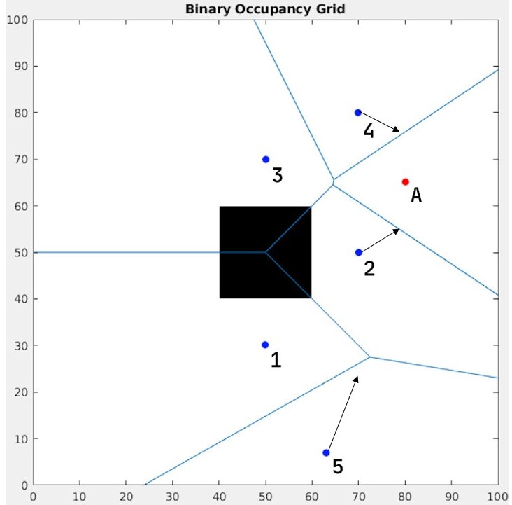
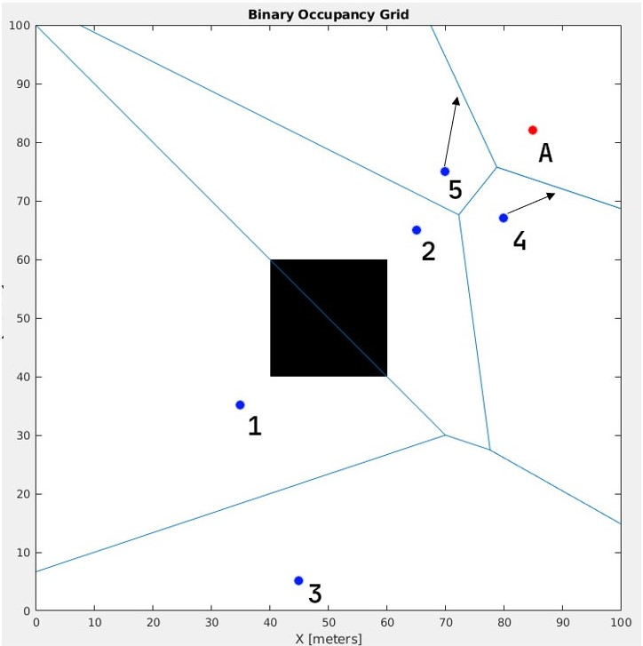
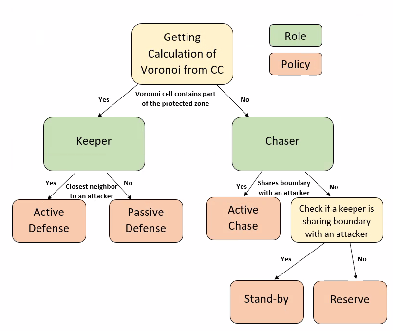

## Environment Model
We define the testing area as 3 nested rectangles around the same center:

1. **Sight area** - Our central computer can detect agents and attackers throughout this area.  
2. **Fight area** - Our agents will move only inside the boundaries of this rectangle.  
3. **Protected zone** - Intrusion by attackers to this area means the defender team did not achieve it's goal.

At each time unit, the central computer will divide the area into Voronoi cells according to the position of the different participants (agent and attackers)

## Goal
The agents aim to keep the attackers out of the protected zone.
In each iteration of the simulation (or game) the success or failure will be defined as following:

1. **Win:** The defenders kept the attackers out of the protected zone for a predefined amount of time.
2. **Loss:** An attacker entered the protected zone during the game

During a game, if there is contact between an attacker and an agent, The attacker is destroyed.

## Robot policies
We are dividing the roles of the Robots into 2 main roles.  
For each role we define it's policies for handling situation.  
The role of each agent will be determined by his understanding of the area layout in the current situation in the following manner:  

 - If the agent's Voronoi cell contains part of the protected zone - The agent will take the role of keeper.  
 - Otherwise - The agent will take the role of chaser.


{width=40%}


In the above figure, agents 1-3 have part of the protected zone in their Voronoi cell, therefore they take the role of keepers, and 4-5 do not contain the protected zone in their Voronoi cell and they take the role of chasers .

### Keepers
The Keepers priority is to defend the protected zone, and will do it in the following way:

#### Policies
Generally keepers' land coverage is defined by their distance from other potential attackers.  
Therefore, if an attacker gets closer to the keeper, the latter loses coverage, and needs to compensate by moving forward in order to keep the Voronoi boundary at approximately the same place.

For that purpose we define 2 policies in which the keepers will operate:

1. **Passive Defense:**  
    * state: The keeper is not the closest neighbor **(\*\*)** to any of the attackers.
    * operation: 
        - If the area is not covered, move in a direction that will maximize cover of exposed area.
        - If protected maximize Voronoi coverage around protected area.
2. **Active Defense:**
    * state: The keeper is the closest neighbor of an attacker.
    * operation: 
        - The keeper will move towards the attacker.
    In figure 1, agent 1 uses passive defense as he doesn't share a border with any attacker.  Agent 2 is the closest neighbor to attacker A, so he used active defense policy.  
    Agent 3 is a passive defender even though he shares a border with attacker A, because agent 2 is closer to A then him.

**\*\*** Closest neighbor: The agent with the shortest distance from an attacker among the agents who share a boundary with said attacker.

## Chasers
The Chasers consider themselves as such if there are enough keepers to cover the protected area.

### Policies

1. **Active-chase:**  
    * state: Chaser shares Voronoi boundary with an attacker
    * operation:
        - The chaser will move towards the middle of the boundary.
        
    In figure 1 agent 4 acts as an active-chaser, because he shares a boundary with an attacker.
2. **Reserve:**
    * state: The Chaser does not share Voronoi boundary with an attacker, and a keeper does share a boundary with an attacker
    * operation: 
        - The Chaser will move towards the attacker
    In figure 1, agent 5 is follows reserve policy, as he does not share a border with an attacker, but agent 2 (keeper) is.
3. **Stand-by:**
    * state: The Chaser does not share Voronoi boundary with an attacker, and no keeper shares a boundary with an attacker
    * operation: 
        - The chaser will move towards a pre-defined area (e.g. 1/3 of the distance between the center of the field and the edge) and will stay their until change of state.

    {width=40%}

    In the figure above, agent 3 follows a stand-by policy because none of the keepers (agents 1,2) share a border with an attacker.

\pagebreak
## Pseudo-code

```
1. For each agent:
    2. Get Voronoi map from central computer
    3. if protected area is inside Voronoi cell  
        1. set role as keeper
    4. else
        1. set role as chaser
    5. Determine policy according to situation
    6. Move according to policy.
```

{width=70%}
